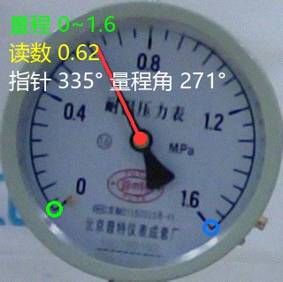
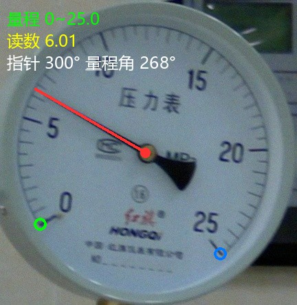
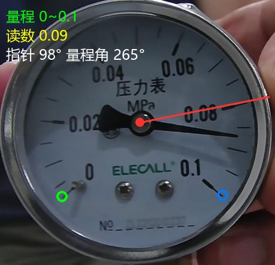
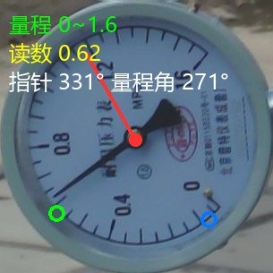

# 指针式仪表自动读数系统

揭榜挂帅 Track 35 · 北京普龙科技有限公司

基于 **YOLOv8 检测 + YOLOv8-Pose 关键点 + 值分类数字检测器** 的指针式仪表自动读数系统。自动检测指针角度、识别表盘量程，实现任意量程仪表的读数。**不依赖 OCR。**

## 效果演示

| 压力表 (0~1.6) | 压力表 (0~25) |
|:---:|:---:|
|  |  |

| 真空表 (0~0.1) | 旋转表盘校正 |
|:---:|:---:|
|  |  |

自动识别量程 + 指针角度 + 读数，含旋转表盘校正。

## 系统架构

```
图片 → 表盘检测(YOLOv8n) → 裁剪
      → 指针+刻度关键点(YOLOv8n-Pose) → 指针角度 + 刻度位置
      → 值分类数字检测器(YOLOv8n) → 读出刻度数字
      → 角度比例法 → 读数
```

### 读数公式

```
读数 = (指针角度 - 零刻度角度) / 量程扫角 × 最大量程值
```

- 量程 = 值分类检测器读出的右刻度数字（支持任意量程，无预设列表）
- 最小量程默认 0

## 模型下载

模型权重通过 **GitHub Release** 发布，下载后放到 `models/` 目录：

| 模型 | 文件名 | 说明 |
|------|--------|------|
| 表盘检测 | `det.pt` | YOLOv8n |
| 指针+刻度关键点 | `keypoint.pt` | YOLOv8n-Pose，3类(指针/左刻度/右刻度) |
| 值分类数字检测器 | `digit_det.pt` | YOLOv8n，19类(0.02~25) |

从 [Releases](../../releases) 下载，放入 `models/`，即可运行。

## 快速开始

```bash
# 安装依赖
pip install -r requirements.txt

# 放置模型 (从Release下载到 models/)
#   det.pt / keypoint.pt / digit_det.pt

# 启动服务
python app_v2.py --port 8004
```

模型路径支持环境变量覆盖：
```bash
export GAUGE_DETECTOR=/path/to/det.pt
export GAUGE_KEYPOINT=/path/to/keypoint.pt
python app_v2.py
```

## 性能

| 指标 | 数值 |
|------|------|
| 指针角度误差 | median 0.6°（94% <5°）|
| 读数成功率 | 442/444（99.5%）|
| 量程识别 | 任意量程，无预设 |

## API

### 单图分析
```bash
POST /api/analyze
files: {file: image.jpg}
```
返回：读数、量程、指针角度、标注图(base64)、置信度。

### 批量处理
```bash
POST /api/batch
files: [file1, file2, ...]
```
返回：JSON 结果 + CSV。

### 历史 / 统计
```bash
GET /api/history
GET /api/stats
```

## 核心模块

| 文件 | 功能 |
|------|------|
| `app_v2.py` | Web 服务（FastAPI） |
| `src/full_reader.py` | 端到端读数（关键点 + 值分类检测器） |
| `src/keypoint_reader_v2.py` | 指针+刻度关键点读取（含旋转校正、多模型投票） |
| `src/scale_reader_v2.py` | 角度比例法读数 |
| `src/config.py` | 模型路径集中配置 |

## 训练

训练脚本见 `scripts/`：
- `train_digit_yolo.py` — 值分类数字检测器训练
- `build_digit_dataset.py` — 数字标注数据集构建
- `annotate_digits.py` — 浏览器数字标注工具

## 已知限制

- **模糊表盘**：严重模糊下指针/数字检测可能不准
- **指针极少数图像**：约 5% 图指针方向误差 15-20°（多模型投票已改善）
- **非圆形表盘**：当前方案针对圆形/扇形表，异形表需形状归一化扩展

## 部署说明

`localhost` 仅本机访问。若需局域网访问：`python app_v2.py --host 0.0.0.0 --port 8004`，用内网 IP 访问。也可部署到边缘硬件（如 RK3568）本地推理。
